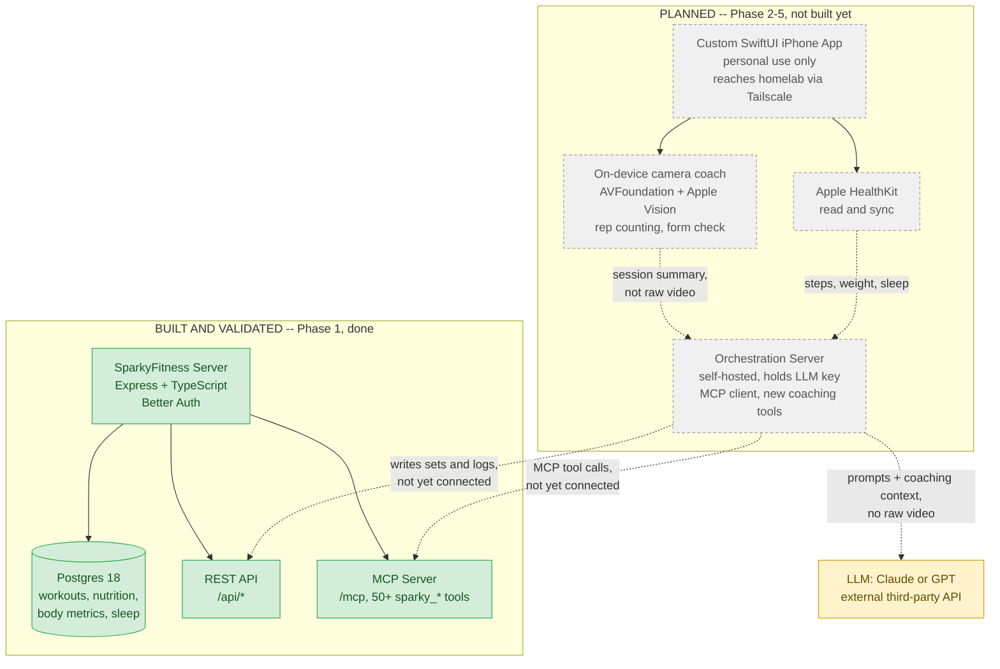

# MotionCoach AI

A personal AI fitness coach that actually knows your training history — built
for one person's own use, shared here so a friend can follow along.

## The problem this is solving

Generic fitness apps log data. Generic AI chatbots give generic advice that
forgets everything the moment the conversation ends. Neither one actually
looks at *your* last 8 weeks of workouts before telling you what to do today.

MotionCoach AI is an attempt to close that gap: a coach that reasons over
real stored history — your actual sets, reps, weights, body measurements,
nutrition, and sleep — before making a recommendation, instead of guessing.
Long term, it also aims to watch your *form*, on your phone, on-device, so a
squat or a curl gets real-time feedback without needing a personal trainer
in the room.

## Why it isn't built from scratch

Fitness tracking (logging workouts, nutrition, measurements, generating
reports) is a solved problem. Rebuilding it would just be months of work
duplicating something that already exists and works well.

Instead, MotionCoach AI is layered on top of
[SparkyFitness](https://github.com/CodeWithCJ/SparkyFitness) — an
open-source, self-hosted fitness data platform — and adds exactly the two
things it doesn't already provide:

1. **An AI coaching layer** that reasons over real historical data through
   SparkyFitness's own MCP tool server, instead of a plain chatbot that
   forgets everything between messages.
2. **On-device camera coaching** (rep counting, form feedback) using Apple's
   Vision framework — video is analyzed on the phone and never uploaded
   anywhere.

Everything runs on infrastructure I control (a self-hosted homelab
instance), so the actual fitness/health data never leaves my own network
except for the specific prompts sent to an LLM for coaching reasoning.

## Architecture

The green boxes are built and validated with real data. The grey dashed
boxes are the intended design — not built yet. The diagram is honest about
that split on purpose: no part of this should look more finished than it is.



**Legend:** solid boxes/edges = built and proven with real requests. Dashed
grey boxes/edges = designed, not yet built. The yellow box is the one place
data leaves the self-hosted network at all — and even then, only the coaching
prompt, never raw video or the full database.

## Status: Phase 1 complete

What's actually proven right now, with real evidence (not just "it runs"):

- SparkyFitness deployed self-hosted via Docker, containers healthy, real
  HTTP responses confirmed (not just container status).
- Data survives a full restart.
- Real user auth, real REST reads/writes, real MCP tool calls — all
  cross-checked against each other so REST and MCP are proven to hit the
  same underlying data, not separate paths.
- SparkyFitness's existing coaching tools proven to actually ground their
  output in stored history (a generated coaching suggestion referenced a
  distinctive fake food name that only existed in the test data — provable,
  not just plausible-sounding).

Full write-up: [`docs/evidence/PHASE1_REPORT.md`](docs/evidence/PHASE1_REPORT.md).

**Not started yet:** the SwiftUI app, the orchestration server, HealthKit
sync, and the camera coaching feature. That's Phase 2 onward.

## Repository layout

```
motioncoach-ai/
├── docs/
│   └── evidence/        # Phase 1 test evidence (sanitized, synthetic data only)
├── infra/
│   └── sparkyfitness/   # docker-compose.yml (fetched from upstream release) + .env
├── scripts/              # REST + MCP validation scripts
├── tests/                 # automated test files
└── README.md
```

## Relationship to the upstream project

A read-only reference clone of the upstream SparkyFitness repo lives at
`../reference/SparkyFitness` (sibling directory, outside this repo). This
repo never copies that source tree and never modifies it — it only talks to
SparkyFitness's REST API and MCP server over HTTP, exactly as any other
client would. SparkyFitness's license is non-commercial source-available;
that only matters if we redistributed its source, which we do not.

## Running SparkyFitness locally

```bash
cd infra/sparkyfitness
cp .env.example .env   # then fill in real generated secrets, never commit .env
docker compose -p motioncoach -f docker-compose.yml up -d
```

The stack runs under the `motioncoach` Compose project name and uses
project-local bind-mount paths (`infra/sparkyfitness/postgresql`,
`infra/sparkyfitness/uploads`, `infra/sparkyfitness/backup`) so it never
collides with any other Docker stack on this machine.

## Validation scripts

See `scripts/` for the REST and MCP validation scripts used to prove the
chain (deploy → auth → REST write/read → MCP write/read → coaching tools
grounded in real data) works. See `docs/evidence/` for the sanitized
request/response evidence captured during Phase 1.

## Roadmap

1. ~~Deploy SparkyFitness, validate REST + MCP + coaching grounding~~ — done
2. AI trainer MVP: orchestration server + basic coaching chat over MCP tools
3. Deterministic training-intelligence logic (progression rules, plateau
   detection, volume tracking) sitting alongside the LLM
4. Camera MVP: one exercise, on-device pose detection, reliable rep counting
5. Integrated app: fitness data + AI trainer + camera coach + Apple Health

## A note on scope

This is a personal project, not a product. It's built for one person's own
training, self-hosted on a homelab, distributed to exactly one iPhone via
TestFlight — not the App Store. Public here so the build is visible, not
because it's meant for general use.
